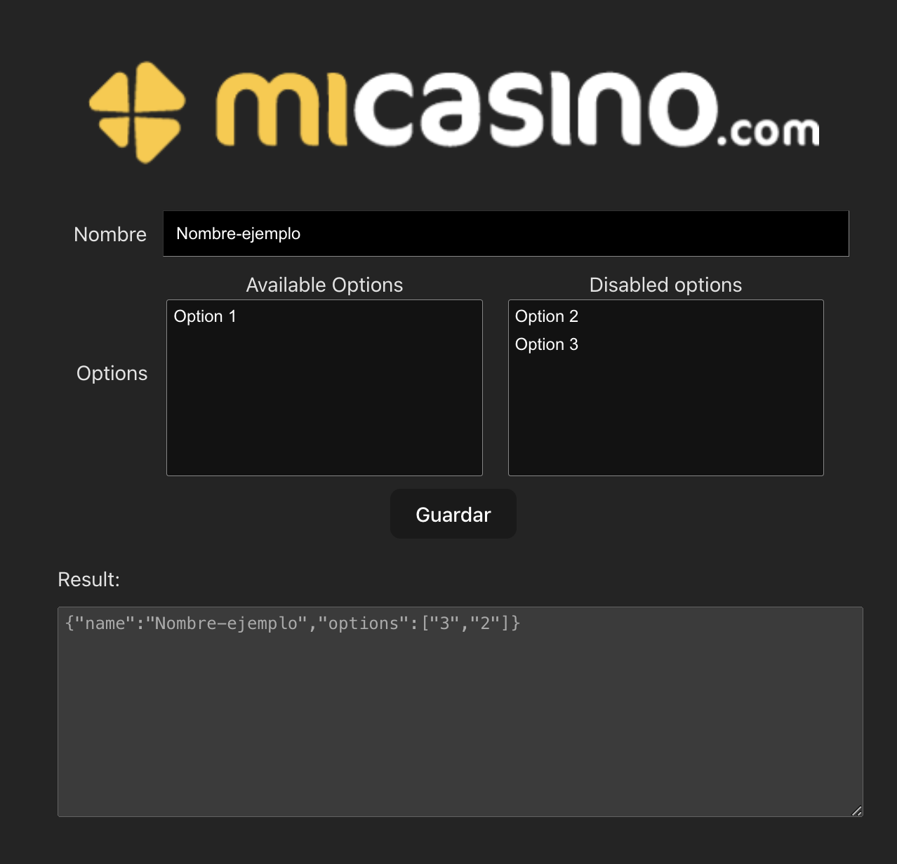

# Prueba MiCasino

El repo contiene un formulario modular. 

- npm i / npm run dev

- Se debe descomentar las lineas de App.vue para habilitar el campo Options.
- Se debe crear el componente SelectUnselectField.vue con las siguientes funcionalidades:
  - Al clicar en una opción, cambie de Available a Disabled, y viceversa.
  - Una vez cambia el estado de una opción, se debe actualizar el componente superior.
  
- Si el resultado es correcto, una vez se clica en guardar, aparecerá el resultado en el textarea.
- Se debe aplicar estilos css según la imagen.

